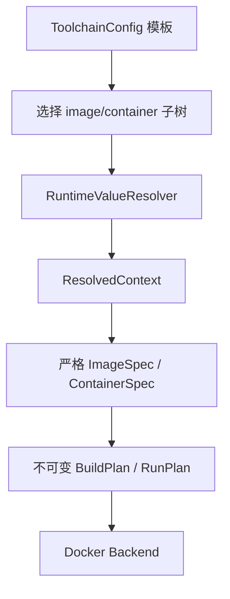

# 架构

## 设计边界

仓库按照“配置模板、运行时取值、严格业务模型、执行计划、后端”拆分：

- `config` 只负责 YAML I/O 和根模型。
- `parameters` 发现内联 `PromptValue`、按照路径取值，并物化严格模型；它不知道 Docker。
- `images` 和 `containers` 各自定义模板、严格模型、计划器和后端协议。
- `application` 选择配置、协调解析和计划，不处理终端展示。
- `cli` 与 `cli.menu` 是两个薄前端，共用相同 use case。
- `providers.docker` 是副作用边界，输入只能是已经校验的不可变计划。

## 运行时值

`PromptValue` 直接出现在业务字段位置，不建立全局参数表，也不使用引用。运行时路径由配置位置自然产生，例如 `containers.development.privileged`。

执行某个操作时只收集所选子树的 prompts。因此构建 `images.development` 不会询问任何容器参数，也不会询问其他镜像的参数。values 文件和 overrides 会先与整份配置的已知路径核对，以捕获拼写错误，再过滤到当前操作。

解析器仅校验交互语义：confirm、select 和 repeat。随后 `materialize_as` 将解析值放回模板并创建 `ImageSpec` 或 `ContainerSpec`，由目标模型执行数据类型校验。计划器继续校验需要文件系统或领域上下文的规则，例如 Dockerfile 是否存在、挂载是否合法。

## 执行安全

镜像与容器都先创建完整计划，再调用后端。菜单在展示计划后确认，确认前不会检查或调用 Docker。Docker 命令以 argv 元组传给 runner，不经过 shell。计划和解析上下文均不可变，容器输出对环境变量值进行隐藏。

