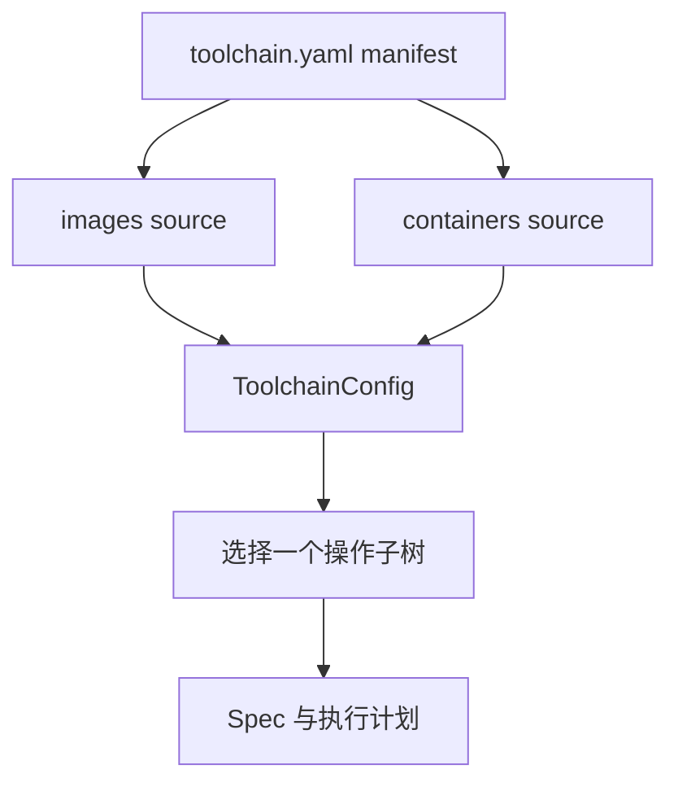
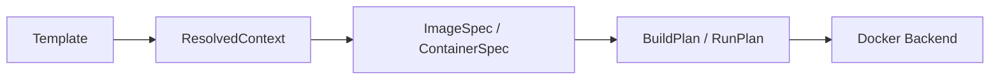

# 架构

## 配置组合

Schema v2 将磁盘配置和应用内配置分开：

根 manifest 包含 `version`、`metadata` 和 `sources`。加载器以 manifest 所在目录解析 source 路径，分别校验外部文件，并组装不可变的 `ToolchainConfig`。外部文件错误保留其真实文件、行和列；Dockerfile、context 和 bind mount 则始终相对于 manifest 目录。

当前不支持递归 include、多文件合并或覆盖。后续加入 builds、tests、scenarios 时，可以在 `sources` 下扩展，不改变根配置职责。

## 应用边界

- `config` 负责 manifest、外部 YAML I/O、错误定位和配置组装。
- `parameters` 发现内联 `PromptValue`，按完整路径取值并物化严格模型。
- `images` 与 `containers` 定义模板、严格 Spec、不可变计划和后端协议。
- `application` 选择配置并协调解析与计划。
- `cli` 和一次性 `cli.menu` 共用应用 use case。
- `providers.docker` 只接受已经验证的计划。

运行流程为：

执行某个操作只收集选中子树的 prompts。因此构建 `images.development` 不会询问其他镜像或容器。values 和 overrides 先与全局已知路径比对以捕获拼写错误，再过滤到当前操作。

镜像和容器都先生成完整计划。菜单展示计划并确认后才调用 Docker；命令通过 argv 传给 runner，不经过 shell。

