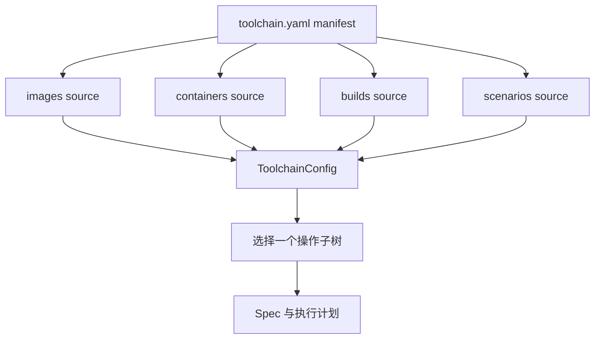
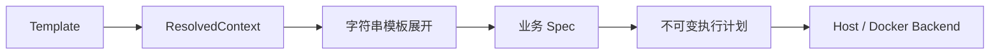

# 架构

## 配置组合

Schema v2 将磁盘配置和应用内配置分开：

根 manifest 包含 `version`、`metadata` 和 `sources`。加载器以 manifest 所在目录解析 source 路径，分别校验外部文件，并组装不可变的 `ToolchainConfig`。外部文件错误保留其真实文件、行和列；Dockerfile、context 和 bind mount 则始终相对于 manifest 目录。

当前不支持递归 include、多文件合并或覆盖。后续加入 tests 时，可以在 `sources` 下扩展，不改变根配置职责。

## 应用边界

- `config` 负责 manifest、外部 YAML I/O、错误定位和配置组装。
- `parameters` 发现内联 `PromptValue`，按完整路径取值并物化严格模型。
- `builds`、`images`、`containers` 与 `scenarios` 定义模板、严格 Spec、不可变计划和后端协议。
- `application` 选择配置并协调解析与计划。
- `cli` 和一次性 `cli.menu` 共用应用 use case。
- `providers.docker`、`providers.host`、`providers.tmux` 和 `providers.supervisor` 只接受已经验证的计划。
- `execution` 提供共享的 argv subprocess runner，任何 provider 都不调用隐式 shell。

运行流程为：

执行某个操作只收集选中子树的 prompts。因此执行 `builds.native` 不会询问其他 build、镜像或容器。values 和 overrides 先与全局已知路径比对以捕获拼写错误，再过滤到当前操作。

字符串模板同样只物化所选操作子树。Application 在一次计划操作开始时冻结宿主环境和一个
带时区的时间快照，并将同一 renderer 传给该操作的所有字段；Scenario 的多个 group 和 profile
也共享同一个快照。renderer 支持 `env`、本地 `date`、UTC `utcdate` 和转义，不递归处理替换
结果。模板展开后再由严格 Spec 和 Planner 完成类型及业务约束校验。

build、镜像和容器都先生成完整计划。菜单展示计划并确认后才调用 backend；命令通过 argv 传给 runner，不经过 shell。

## 场景

Scenario 将公共 group 定义与运行 profile 分开。Application 先解析所选 profile 及 group enablement，再组合启用 groups 的 prompts；这使 profile 和 group 两级都保持惰性。

tmux provider 在宿主机为每个 group 创建窗口并运行 `docker exec -it`，适合交互式调试。Compose-supervisor provider 按 service 生成 supervisord program 文件，Docker Compose 负责容器生命周期，supervisord 负责容器内进程重启、信号和日志。二者消费同一组容器内脚本，但不把 tmux 与 supervisord 误认为同层级进程管理器。

## 工程编译

`BuildTemplate` 描述工程脚本、解释器 argv、工作目录、环境覆盖和可选超时。运行时参数解析后生成 `BuildSpec`，`BuildPlanner` 再将相对路径按根 manifest 目录解析，并冻结完整宿主环境形成 `BuildPlan`。

`HostBuildBackend` 将脚本标准输入、输出和错误直接连接当前终端，适合长时间编译和 CI 日志。工具链不识别具体构建系统；native、交叉编译或其他构建方式只是不同的命名 build。脚本失败、超时和解释器不可用会转换成稳定的工具链错误码。

## 容器生命周期

`ContainerRunPlan` 除了 Docker run 参数，还包含已经冻结的 `ContainerHookPlan`。每个 hook 记录阶段、脚本路径和内容、SHA-256、解释器 argv、容器用户、工作目录、环境变量和超时。

创建服务先调用容器 backend，再依次调用 phase-aware hook executor。当前支持：

1. `post_create`：容器首次创建并启动后执行。
2. `post_start`：容器每次启动后执行；当前创建流程也算首次启动，因此排在 `post_create` 之后执行。

目前还没有独立的 start/stop/remove 命令，所以不接受不会被执行的 `pre_stop` 或 `pre_remove` 配置。以后增加相应操作时，可以复用同一个 hook 计划与执行端口。

脚本从工程侧读取并通过 stdin 交给容器解释器，宿主机不执行脚本。hook 失败不回滚 `docker run`，错误会明确说明容器已保留；这让交叉编译环境能够进入容器诊断，同时避免假装跨宿主挂载的修改具有事务性。
