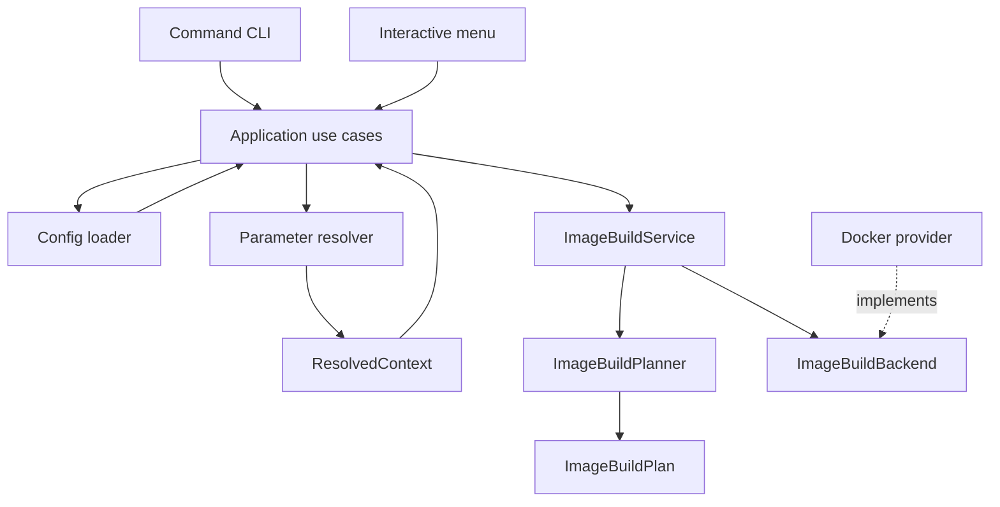

# Architecture

The toolchain separates configuration, domain planning, application orchestration, and external execution. A feature must not collapse those responsibilities into a CLI handler or a provider implementation.



## Package responsibilities

| Package | Responsibility | Must not |
|---|---|---|
| `config` | Load YAML and compose top-level feature models | Execute commands or resolve runtime values |
| `parameters` | Validate, order, and resolve declarative parameters | Know about images or Docker |
| `images` | Validate image semantics, create plans, orchestrate builds | Read YAML or invoke subprocesses |
| `providers.docker` | Translate build steps into Docker CLI calls | Read project configuration or parameter sources |
| `application` | Accept typed requests and coordinate loaders, resolvers, and services | Render terminal output or depend on `argparse` |
| `cli.commands` | Parse scriptable commands and render command results | Contain domain rules or construct Docker commands |
| `cli.menu` | Manage prompts and in-memory session overrides | Call command handlers or persist parameter edits |

The command frontend and menu frontend meet at application use cases. A menu action constructs the same `ParameterRequest` or `BuildImageRequest` as a command handler; it never synthesizes command-line arguments to invoke another frontend.

## Stable data boundaries

`ResolvedContext` is the only parameter output consumed by feature domains. Feature code never reads environment variables, values files, CLI overrides, or interactive input directly.

`ImageBuildPlan` is the only input needed by an image backend. It contains resolved paths, image references, build arguments, ordered steps, and Dockerfile fragments. The Docker provider never receives the original YAML model.

Both objects are immutable. This prevents a backend from changing the configuration that was validated and presented to the user.

## Layered image invariant

An image has one configured base and one or more ordered Dockerfile fragments. Fragments cannot contain `FROM`. For step `n > 1`, the base image is exactly the output tag of step `n - 1`. The final step writes the configured public tag; earlier steps use deterministic internal tags.

```text
configured base -> layer 1 -> internal tag -> layer 2 -> ... -> final tag
```

This invariant is established by `ImageBuildPlanner`, not by the Docker provider.

## Provider boundary

`ImageBuildBackend` is a protocol. The current `DockerImageBackend` executes `docker build` through an injectable `CommandRunner`. Commands are always argument tuples and never use a shell.

A future Dagger or Buildx backend should implement the same port. It must not require changes to parameter resolution, image configuration, or `ImageBuildService` unless it introduces genuinely new domain capabilities.

## Adding future features

Containers, cross-compilation, scenarios, compilation, and tests should use the same flow:

```text
configuration model -> ResolvedContext -> immutable plan -> service -> backend/provider
```

Shared code should only move into a common package after at least two feature domains require the same abstraction. Avoid speculative `utils`, generic manager classes, and provider-specific fields in top-level domain models.
