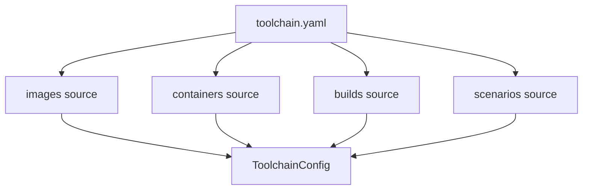
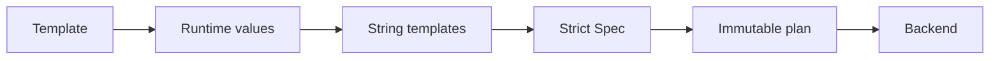

# 架构

## 配置组合

Schema v3 将根 manifest 与领域 source 分开。加载器以 manifest 所在目录解析 source，保留每个定义的来源文件和 YAML 错误位置，并组装不可变的 `ToolchainConfig`。

## 应用边界

- `config`：manifest、source YAML、错误定位和配置组装。
- `parameters`：PromptValue、显式值来源、动态候选和字符串模板。
- `images`、`containers`、`builds`：严格 Spec、Planner、Service 和 Backend 协议。
- `scenarios`：严格 Spec、Planner、Service 和唯一的 tmux executor。
- `application`：选择配置子树，协调参数解析和计划生成。
- `cli`：直接命令和一次性交互菜单。
- `providers`：Docker 等外部系统适配器。
- `execution`：共享的无 shell argv runner。

一次操作开始时冻结宿主环境和带时区时间快照，同一操作中的所有模板共享该快照。应用只解析所选资源子树，未选择的资源不会触发提示或读取模板环境变量。

## 计划优先

业务模块先完成参数物化、路径规范化和约束校验，再生成不可变计划。菜单可以在执行前展示并确认计划，CLI 的 dry-run 也在计划生成后停止。执行端只接受已经验证的计划，不重新解释配置。

## 场景边界

tmux 是唯一场景进程入口：scenario 映射 session、instance 映射 window、group 映射 pane。已有容器模式由 profile 控制启动/重启；Compose 模式使用稳定 project name 管理开发容器。Compose 只负责开发容器生命周期，场景不承担生产部署职责。

## 容器脚本

build 的 script 是容器内路径，由 `docker exec` 执行。container hook 的 script 是宿主工程文件，计划阶段读取并计算 SHA-256，执行阶段通过 stdin 发送给容器解释器。两者都不经过宿主 shell。
