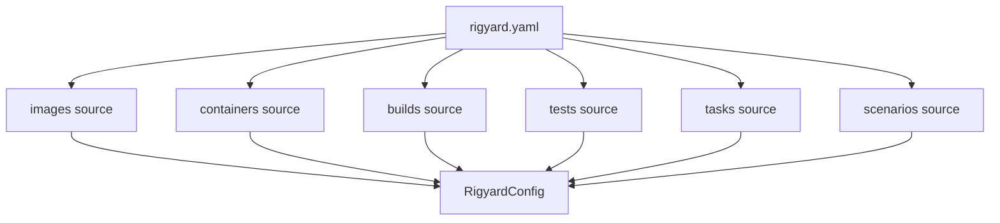

# Architecture

## Configuration assembly

Schema version 3 separates the root manifest from domain sources. The loader resolves source paths relative to the manifest, retains each definition's source file and YAML location, and assembles a `RigyardConfig` snapshot intended for read-only use. Its resource mappings and nested model collections are recursively frozen. Serialization produces ordinary detached collections.

## Application boundaries

- `config`: manifest and source YAML, error locations, and configuration assembly.
- `parameters`: PromptValues, explicit value sources, dynamic candidates, and string templates.
- `images`, `containers`, `builds`, `tests`, and `tasks`: strict specs, planners, and backend protocols. Image/container services coordinate multi-step execution; build/test/task use cases call their backends directly.
- `container_commands`: shared fields and execution planning for build, test, and task commands; each domain retains its own script and result semantics.
- `scenarios`: strict specs, planner, scenario orchestration, dedicated tmux and Docker/Compose lifecycle backends, and a command gateway that normalizes process failures.
- `application`: resource selection, value resolution, and plan coordination.
- `cli`: direct commands and the one-shot interactive menu.
- `providers`: adapters for Docker and other external systems.
- `execution`: the shared argv-only subprocess runner.

At the start of an operation, the application freezes the host environment and one timezone-aware timestamp. Every template in that operation shares the snapshot. Only the selected resource subtree is resolved, so unrelated prompts and environment lookups remain lazy.

## Plan-first execution

Business modules materialize parameters, normalize paths, and validate constraints before creating immutable plans. The menu can display and confirm a plan, and supported CLI dry-runs stop at the same boundary. Executors accept validated plans and never reinterpret configuration.

## Scenario boundary

tmux is the only scenario process entry point: scenarios map to sessions, instances to windows, and groups to panes. `ScenarioExecutor` owns startup and shutdown orchestration, while `TmuxSessionBackend` encapsulates session, window, and pane commands and dedicated lifecycle backends manage existing Docker containers and Compose projects. Compose mode uses a stable project name to manage development containers. Compose handles development container lifecycle only; scenarios are not production deployment orchestration.

## Container scripts

Build, test, and custom-task scripts are container paths executed through `docker exec`. Their domain planners delegate common command normalization to `container_commands` and then add domain-specific identity and result data. Test and task output is streamed without interpretation. A container hook script is a host project file read and hashed during planning, then sent to the container interpreter over stdin. None of these paths uses an implicit host shell.

## Definition catalog

`DefinitionCatalog` identifies resources by kind, source path, and name. Source
entries are authoritative; top-level resource mappings are derived compatibility
views. Resource execution, parameter discovery, and menu grouping use the catalog.
Project-wide `inspect` and `resolve` reject ambiguous names and accept `--source`
to select a source. Internal provenance is never exposed as a runtime parameter path.

`application.resolution.resolve_definition` shares selection, template context, and
spec materialization across images, containers, builds, tests, and tasks. Each feature
keeps its own planner and execution semantics.

## Scenario runtime boundary and recovery

`ScenarioPlan` carries executable startup data; `ScenarioControlPlan` carries only
runtime addresses. `ScenarioService` records lifecycle state and coordinates atomic
record updates with project-level locking. Control planning consults those records
before loading the current manifest. The startup executor retains its diagnostic
failure behavior; records preserve the target needed to stop or remove failed runs.

`ContainerRuntime`, `ComposeRuntime`, `SessionRuntime`, and `ScenarioBackend` are
injectable protocols. `scenarios.assembly` wires their Docker/tmux implementations.
This separates lifecycle policy from process transport without requiring a plugin
framework. Backend tests can exercise actual orchestration with in-memory adapters.

## Immutability and serialization

Configuration and specification models inherit `FrozenModel`: dictionaries become
read-only mappings and lists become tuples, including prompt defaults and nested
scenario groups. Inputs are copied during freezing so later caller mutations cannot
change a snapshot. Request overrides are also recursively frozen. Model serialization
returns detached ordinary collections, and parameter resolution returns ordinary
values for CLI JSON/YAML output. Treat `model_copy(update=...)` and `model_construct`
as Pydantic's explicit validation bypasses, not configuration-loading APIs.
