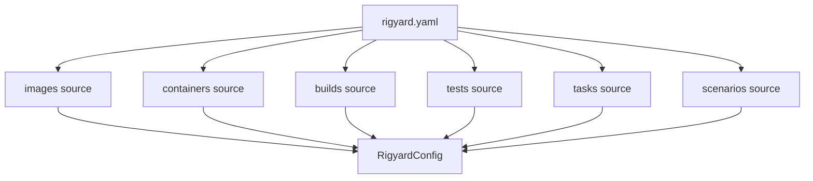
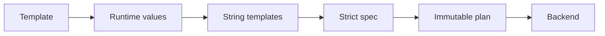

# Architecture

## Configuration assembly

Schema version 3 separates the root manifest from domain sources. The loader resolves source paths relative to the manifest, retains each definition's source file and YAML location, and assembles an immutable `RigyardConfig`.

## Application boundaries

- `config`: manifest and source YAML, error locations, and configuration assembly.
- `parameters`: PromptValues, explicit value sources, dynamic candidates, and string templates.
- `images`, `containers`, `builds`, `tests`, and `tasks`: strict specs, planners, services, and backend protocols.
- `scenarios`: strict specs, planner, service, and the single tmux executor.
- `application`: resource selection, value resolution, and plan coordination.
- `cli`: direct commands and the one-shot interactive menu.
- `providers`: adapters for Docker and other external systems.
- `execution`: the shared argv-only subprocess runner.

At the start of an operation, the application freezes the host environment and one timezone-aware timestamp. Every template in that operation shares the snapshot. Only the selected resource subtree is resolved, so unrelated prompts and environment lookups remain lazy.

## Plan-first execution

Business modules materialize parameters, normalize paths, and validate constraints before creating immutable plans. The menu can display and confirm a plan, and supported CLI dry-runs stop at the same boundary. Executors accept validated plans and never reinterpret configuration.

## Scenario boundary

tmux is the only scenario process entry point: scenarios map to sessions, instances to windows, and groups to panes. Existing-container mode applies profile lifecycle policy, while Compose mode uses a stable project name to manage development containers. Compose handles development container lifecycle only; scenarios are not production deployment orchestration.

## Container scripts

Build, test, and custom-task scripts are container paths executed through `docker exec`. Test and task output is streamed without interpretation. A container hook script is a host project file read and hashed during planning, then sent to the container interpreter over stdin. None of these paths uses an implicit host shell.
